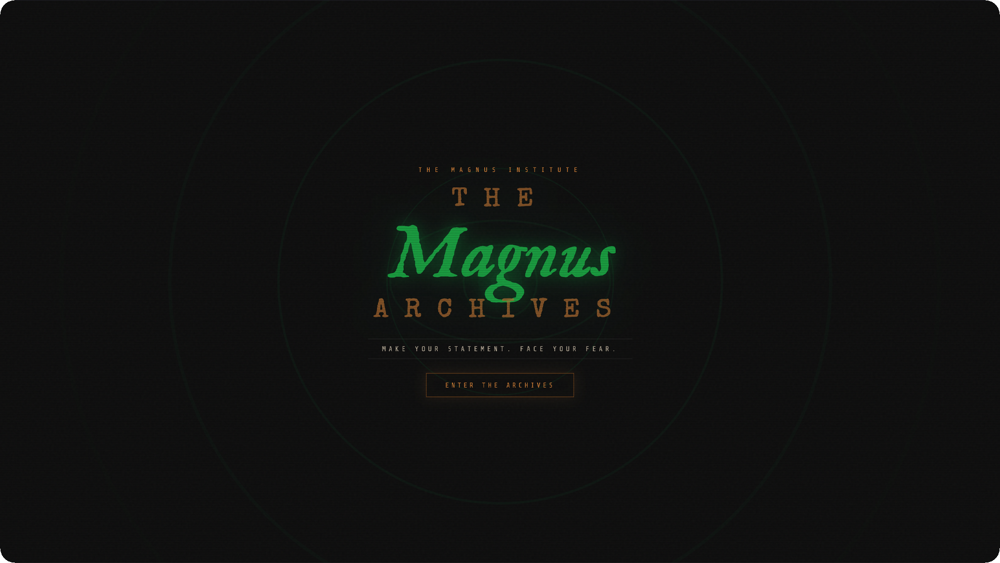

# The Magnus Archives

✨ [LIVE DEMO](https://magnus-archives.netlify.app/)

A fan page for [The Magnus Archives](https://rustyquill.com/show/the-magnus-archives/) podcast by Rusty Quill. Originally created as a SheCodes challenge project. Redesigned for extra spooky vibes!

---

## Features

- Animated SVG eye with expanding rings in the hero
- Rotating quote generator with fade transition
- Noise texture and scanline overlays
- Fully responsive

---

*The Magnus Archives* podcast written by Jonathan Sims, directed by Alexander J. Newall, and distributed by [Rusty Quill](https://rustyquill.com/).

